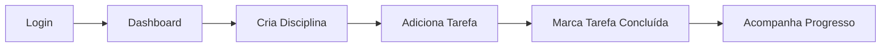

# Plataforma de Apoio ao Estudante EAD com Cloud

## 💡 Visão Geral

---

## 📋 Requisitos Funcionais
- Cadastro e login de usuários (e-mail/senha, Firebase Auth)
- CRUD de disciplinas e tarefas
- Definir prazos para tarefas
- Marcar tarefas como concluídas
- Visualizar progresso do estudante
- Notificações simples (e-mail)
- Interface acessível (PCD)

## 📋 Requisitos Não Funcionais
- Tempo de resposta esperado: < 1s para ações comuns (login, CRUD)
- Escalabilidade automática (Firebase Functions/Firestore)
- Suporte recomendado: até 10.000 usuários simultâneos (pode crescer conforme plano Firebase)
- Disponibilidade: 99,9% (infraestrutura cloud)
- Segurança: criptografia em trânsito, autenticação forte, validação de dados
- Acessibilidade: WCAG AA/AAA, navegação por teclado, ARIA

---

## 🧑‍💻 Fluxos de Usuário



Exemplo:
1. Estudante faz login
2. Cria disciplina (ex: Matemática)
3. Adiciona tarefa (ex: Assistir aula 1)
4. Marca tarefa como concluída
5. Visualiza progresso na dashboard

---

## 🧪 Testes

### Exemplo de teste end-to-end (Cypress)
```js
// cypress/e2e/login.spec.js
describe('Fluxo de login', () => {
	it('Usuário faz login e vê dashboard', () => {
		cy.visit('/');
		cy.get('input[name=email]').type('teste@exemplo.com');
		cy.get('input[name=password]').type('senha123');
		cy.contains('Entrar').click();
		cy.contains('Dashboard do Aluno').should('be.visible');
	});
});
```
- Testes unitários: sim (exemplo: funções utilitárias, validação de dados)
- Testes de integração: sim (exemplo: integração front-end ↔️ Firebase)
- Testes end-to-end: recomendados (exemplo: fluxo completo de usuário)

### Exemplo de teste unitário (Jest)
```js
// utils/calcProgress.js
export function calcProgress(total, done) {
	if (total === 0) return 0;
	return Math.round((done / total) * 100);
}

// __tests__/calcProgress.test.js
import { calcProgress } from '../utils/calcProgress';
test('calcula progresso corretamente', () => {
	expect(calcProgress(10, 5)).toBe(50);
	expect(calcProgress(0, 0)).toBe(0);
});
```

### Exemplo de teste de integração (React Testing Library)
```js
// __tests__/AuthForm.test.jsx
import { render, screen, fireEvent } from '@testing-library/react';
import AuthForm from '../src/AuthForm';

test('exibe erro ao enviar formulário vazio', () => {
	render(<AuthForm />);
	fireEvent.click(screen.getByRole('button'));
	expect(screen.getByRole('alert')).toBeInTheDocument();
});
```
- Testes unitários: sim (exemplo: funções utilitárias, validação de dados)
- Testes de integração: sim (exemplo: integração front-end ↔️ Firebase)
- Testes end-to-end: recomendados (exemplo: fluxo completo de usuário)

### Como rodar testes (exemplo Jest):
```sh
cd frontend
npm test
```

---

## 🔄 CI/CD
- Integração contínua sugerida: GitHub Actions
- Deploy automatizado: Firebase Hosting/Functions
- Exemplo de pipeline:
	- Instala dependências
	- Roda testes
	- Faz build
	- Deploy automático se testes passarem

### Exemplo de configuração (GitHub Actions):
```yaml
name: CI/CD
on: [push]
jobs:
	build-deploy:
		runs-on: ubuntu-latest
		steps:
			- uses: actions/checkout@v3
			- name: Node.js
				uses: actions/setup-node@v3
				with:
					node-version: 18
			- run: npm ci --prefix frontend
			- run: npm test --prefix frontend
			- run: npm run build --prefix frontend
			- run: npm install -g firebase-tools
			- run: firebase deploy --token ${{ secrets.FIREBASE_TOKEN }}
```

---

## 📡 Documentação da API (Exemplo)

### Endpoint: Criar Tarefa
`POST /api/tasks`

**Body:**
```json
{
	"disciplinaId": "abc123",
	"titulo": "Assistir aula 1",
	"prazo": "2026-04-20"
}
```
**Resposta:**
```json
{
	"id": "task789",
	"status": "ok"
}
```

---

## 🗺️ Roadmap Evolutivo

### Curto prazo (1-2 meses)
- CRUD completo de disciplinas/tarefas
- Progresso visual
- Notificações básicas
- Acessibilidade total

### Médio prazo (3-6 meses)
- Dashboard com gráficos
- Área para professores
- Testes end-to-end
- Integração com apps mobile

### Longo prazo (6-12 meses)
- Recomendações com IA
- Gamificação
- Relatórios avançados
- API pública para integrações

Esta plataforma web foi criada para ajudar estudantes de EAD a organizar seus estudos, acompanhar o progresso e acessar conteúdos de forma simples, moderna e escalável, utilizando recursos de computação em nuvem.

---

## 🎯 Problema que o Projeto Resolve
- Falta de organização dos estudos
- Dificuldade em acompanhar progresso
- Baixa consistência e motivação
- Pouca personalização no aprendizado

---

## ⚙️ Funcionalidades Principais
- Cadastro e login de usuários (Firebase Auth)
- Gestão de disciplinas e tarefas (CRUD)
- Definição de prazos para tarefas
- Marcação de tarefas como concluídas
- Visualização do progresso (percentual de evolução)
- Notificações simples (e-mail)

---

## ☁️ Arquitetura Cloud

```
Usuário → Front-end (React + Tailwind) → API Serverless (Firebase Functions) → Firestore (Banco de Dados)
```

- **Front-end:** React + Tailwind CSS
- **Back-end:** Firebase Functions (Node.js)
- **Banco de dados:** Firestore
- **Autenticação:** Firebase Auth
- **Hospedagem:** Firebase Hosting

---

## 🏗️ Estrutura de Pastas

```
/frontend   # Aplicação React (interface do usuário)
/backend    # Funções serverless (API)
```

---

## 🚀 Como Rodar Localmente

### Pré-requisitos
- Node.js 18+
- Conta no Firebase (https://firebase.google.com/)
- Firebase CLI (`npm install -g firebase-tools`)

### 1. Clone o repositório
```sh
git clone <url-do-repo>
cd <nome-da-pasta>
```

### 2. Instale as dependências
#### Front-end
```sh
cd frontend
npm install
```
#### Back-end
```sh
cd ../backend
npm install
```

### 3. Configure o Firebase
- Crie um projeto no [console do Firebase](https://console.firebase.google.com/)
- Ative Authentication (Email/Password)
- Ative Firestore Database
- Configure Hosting e Functions
- Baixe o arquivo `firebaseConfig` e coloque no front-end (`src/firebaseConfig.js`)

### 4. Inicie o projeto
#### Front-end
```sh
cd frontend
npm start
```
#### Back-end (emulador local)
```sh
cd backend
firebase emulators:start
```

---

## 🌐 Como Publicar na Nuvem (Firebase)

1. Faça login no Firebase CLI:
```sh
firebase login
```
2. Configure o projeto:
```sh
firebase init
```
3. Faça o deploy:
```sh
firebase deploy
```

---

## 🛠️ Tecnologias Utilizadas
- React
- Tailwind CSS
- Firebase Auth
- Firestore
- Firebase Functions
- Firebase Hosting

---

## 🔒 Segurança e Privacidade

- Autenticação segura com Firebase Auth (proteção contra acesso não autorizado)
- Dados sensíveis trafegam apenas por HTTPS
- Regras de segurança do Firestore configuradas para acesso restrito
- Princípios de menor privilégio para funções serverless
- Validação de dados no front-end e back-end
- Monitoramento e auditoria de acessos (Firebase Console)
- Atualizações frequentes de dependências para evitar vulnerabilidades
- Política de privacidade clara e transparente

---

## ♿ Acessibilidade e Inclusão (PCD)

- Interface compatível com leitores de tela (uso de ARIA e semântica HTML)
- Contraste de cores adequado (WCAG AA/AAA)
- Navegação por teclado em todos os fluxos
- Componentes com foco visível e acessível
- Textos alternativos em imagens e ícones
- Layout responsivo para diferentes dispositivos
- Testes de acessibilidade contínuos (ex: Lighthouse, axe)
- Feedbacks visuais e sonoros para ações importantes
- Documentação e exemplos de uso acessível

**Compromisso:** Este projeto é livre para uso e evolução por pessoas com deficiência. Sugestões de melhoria em acessibilidade são bem-vindas e priorizadas.

---

## 📈 Possíveis Evoluções
- Dashboard com gráficos de desempenho
- Recomendações com IA
- Versão mobile
- Foco em acessibilidade
- Área para professores

---

## 🤝 Como Contribuir
1. Faça um fork do projeto
2. Crie uma branch: `git checkout -b minha-feature`
3. Commit suas alterações: `git commit -m 'feat: minha feature'`
4. Push na branch: `git push origin minha-feature`
5. Abra um Pull Request

---

## 📄 Licença
Este projeto é open-source, licenciado sob MIT.

---

## 📬 Contato

---

## 📝 Instruções de Uso

1. Acesse a aplicação pelo navegador (após deploy ou rodando localmente).
2. Faça seu cadastro ou login usando e-mail e senha.
3. Crie disciplinas conforme suas matérias ou áreas de estudo.
4. Adicione tarefas para cada disciplina (ex: assistir aula, fazer exercício).
5. Marque tarefas como concluídas conforme avança.
6. Acompanhe seu progresso visualmente no dashboard.
7. Receba lembretes e notificações (quando configurado).
8. Use a navegação por teclado e recursos de acessibilidade conforme necessário.

---

## 👤 Apresentação

Olá! Meu nome é Márcio Gil. Sou Embaixador do DIO Campus Expert (turma 15) e estou no 5º período de Engenharia de Software. Apaixonado por tecnologia, educação e inclusão digital, desenvolvi esta plataforma para ajudar estudantes EAD a terem mais organização, autonomia e motivação nos estudos, com foco em acessibilidade e experiência real de nuvem.

🔗 [Meu LinkedIn](https://linkedin.com/in/márcio-gil-1b7669309)
# HelpEad

